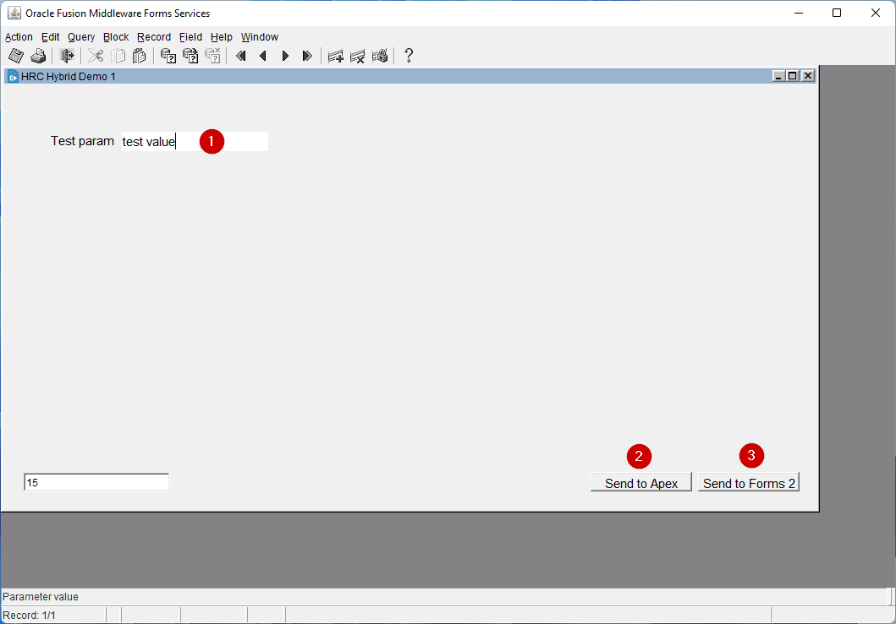
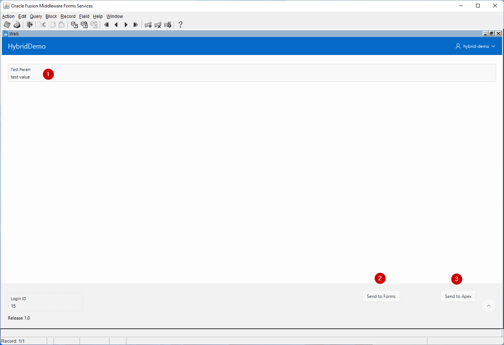

# Hybrid Demo

## Installation

In the following section are the installation instructions for the project. 

### Oracle Database

There are 3 database objects that are needed for the hybrid demo project to work:
- Table: `tab_hybrid_demo_login`
- Table: `tab_hybrid_demo_setup`
- Package: `hybrid_manager`

Inside the `plsql` directory there are all the needed files. Beside the database objects there is a script `install.sql` which is used to distribute all the needed database objects in correct order. 

After all the objects are distributed, the hybrid demo setup parameters have to be set. 

3 parameters are needed:
- `APEX_BASE_URL`: Base Apex application home URL
- `APEX_BASE_APP_ID`: Application id
- `APEX_BASE_PAGE_ID`: Home page id

In the `plsql` directory there is an example file `hybrid_demo_setup.example.sql`, which shows how to setup the needed parameters before you launch the hybrid demo example project.

### Oracle Forms

You need a working Forms server running. After that you compile all `fmb` files inside the `forms` directory.

At the end you deploy the `fmx` files to the Forms server. 

### Java Hybrid

To compile the java project that resides in the `/java/hybrid-demo` you need to have the `oracle.forms.frmall` library available.

The `frmall-11.jar` has to be installed in the local repository `${project.basedir}/src/main/resources/repo` with the following properties:
- groupId: `oracle.forms`
- artifactId: `frmall`
- version: `11`

You install it by running:
```shell
mvn install:install-file -Dfile=[FRMALL JAR LOCATION] \ 
-DgroupId=oracle.forms -DartifactId=frmall -Dversion=11 \ 
-Dpackaging=jar -DlocalRepositoryPath=[PROJECT_BASE_DIR/src/main/resources/repo]
```

Replace:
- `[FRMALL JAR LOCATION]` with the location of the `jar` file 
- `[PROJECT_BASE_DIR/src/main/resources/repo]` with the absolute path of the local project repository

After that you build the project. This will create a `jar` file, which you need to deploy to the local Forms server. 

## Usage

To test the hybrid demo, you have to launch `Java Web Start` and call the `frm_param` form.

You download the `frmservlet.jnlp` file by sending a request to the Oracle Forms server. 

Example request: <http://localhost:9003/forms/frmservlet?config=webutil_webstart&form=frm_param.fmx>

After that you can use the form to pass parameters between `Oracle Forms` and `Oracle Apex` frameworks.

### Example

When you start the example by running the `jnlp` file, the `frm_param` form is displayed like it is shown in the image below. 

In the bottom left field the current login id is displayed, which is used as an identifier for storing parameters.

1 - A text field used to set a context parameter that is tied to the current login session. 

2 - A button sets the parameter to the input value and opens an Oracle Apex form. 

3 - A button sets the parameter to the input value and opens an Oracle Forms form. 




Button 'Send to Apex' opens an Oracle Apex form like shown below. 

1 - A text field used to set a context parameter that is tied to the current login session. 

2 - A button sets the parameter to the input value and opens an Oracle Forms form. 

3 - A button sets the parameter to the input value and opens an Oracle Apex form. 



The field is again used to set the parameter value and by clicking on the buttons in the bottom right corner, you pass the parameter value to the new form. 

In the bottom left corner the current login id is displayed, which shows the current session that is used for passing the parameter between Forms and Apex frameworks. 